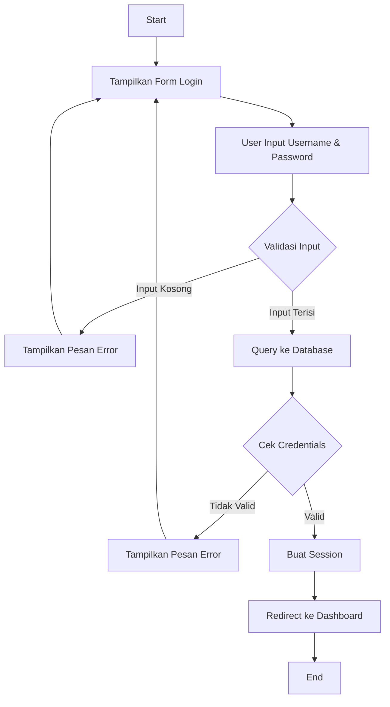

Saya akan membuat modul ajar untuk sistem login manajemen gula aren.


# Modul Pembelajaran Sistem Login PHP MySQL
## Manajemen Gula Aren

### Daftar Isi
1. Pendahuluan
2. Prasyarat
3. Tujuan Pembelajaran
4. Materi Pembelajaran
5. Praktikum
6. Tugas
7. Referensi

### 1. Pendahuluan

Modul ini akan membahas tentang pembuatan sistem login menggunakan PHP dan MySQL untuk aplikasi Manajemen Gula Aren. Sistem login merupakan komponen penting dalam keamanan aplikasi web yang mengatur autentikasi dan autorisasi pengguna.

### 2. Prasyarat

Sebelum memulai modul ini, pastikan telah memiliki:
- Web server (XAMPP/WAMP/LAMP)
- Text editor (VSCode/Sublime Text/dll)
- Browser web
- Pengetahuan dasar HTML dan CSS
- Pengetahuan dasar PHP
- Pengetahuan dasar MySQL

### 3. Tujuan Pembelajaran

Setelah mengikuti pembelajaran ini, siswa diharapkan mampu:
1. Memahami konsep sistem login dan keamanan web
2. Membuat database dan tabel untuk sistem login
3. Mengimplementasikan form login dengan PHP
4. Mengelola session untuk autentikasi
5. Membuat halaman dashboard responsif
6. Mengimplementasikan role-based access control

### 4. Materi Pembelajaran

#### 4.1 Perancangan Database

Database digunakan untuk menyimpan data pengguna sistem. Berikut struktur tabel yang dibutuhkan:

```sql
CREATE DATABASE manajemen_gula_aren;
USE manajemen_gula_aren;

CREATE TABLE users (
    id INT PRIMARY KEY AUTO_INCREMENT,
    username VARCHAR(50) UNIQUE NOT NULL,
    password VARCHAR(255) NOT NULL,
    nama_lengkap VARCHAR(100) NOT NULL,
    role ENUM('admin', 'staff') NOT NULL,
    created_at TIMESTAMP DEFAULT CURRENT_TIMESTAMP,
    updated_at TIMESTAMP DEFAULT CURRENT_TIMESTAMP ON UPDATE CURRENT_TIMESTAMP
);
```

#### 4.2 Koneksi Database

File koneksi database dibuat terpisah untuk memudahkan maintenance:

```php
// config/database.php
function connectDB() {
    $host = "localhost";
    $user = "root";
    $pass = "";
    $db = "manajemen_gula_aren";
    
    $conn = mysqli_connect($host, $user, $pass, $db);
    if (!$conn) {
        die("Koneksi gagal: " . mysqli_connect_error());
    }
    return $conn;
}
```

#### 4.3 Form Login

Form login dibuat menggunakan HTML dengan styling Bootstrap:

```html
<div class="container">
    <div class="row justify-content-center mt-5">
        <div class="col-md-4">
            <div class="card">
                <div class="card-body">
                    <h4 class="card-title text-center mb-4">Login Sistem</h4>
                    <form method="POST" action="">
                        <div class="mb-3">
                            <label class="form-label">Username</label>
                            <input type="text" name="username" class="form-control" required>
                        </div>
                        <div class="mb-3">
                            <label class="form-label">Password</label>
                            <input type="password" name="password" class="form-control" required>
                        </div>
                        <button type="submit" name="login" class="btn btn-primary w-100">Login</button>
                    </form>
                </div>
            </div>
        </div>
    </div>
</div>
```

#### 4.4 Proses Login

Proses login melibatkan beberapa tahap:
1. Validasi input
2. Pengecekan kredensial
3. Pembuatan session
4. Redirect ke dashboard

```php
if(isset($_POST['login'])) {
    $username = mysqli_real_escape_string($conn, $_POST['username']);
    $password = $_POST['password'];
    
    if(empty($username) || empty($password)) {
        $error = "Username dan password harus diisi!";
    } else {
        $query = "SELECT * FROM users WHERE username = ?";
        $stmt = mysqli_prepare($conn, $query);
        mysqli_stmt_bind_param($stmt, "s", $username);
        mysqli_stmt_execute($stmt);
        $result = mysqli_stmt_get_result($stmt);
        
        if($user = mysqli_fetch_assoc($result)) {
            if(password_verify($password, $user['password'])) {
                $_SESSION['user_id'] = $user['id'];
                $_SESSION['username'] = $user['username'];
                header("Location: dashboard.php");
                exit();
            }
        }
    }
}
```

#### 4.5 Pengelolaan Session

Session digunakan untuk menyimpan status login pengguna:

```php
// auth/check_session.php
function checkSession() {
    session_start();
    if (!isset($_SESSION['user_id'])) {
        header("Location: login.php");
        exit();
    }
}
```

#### 4.6 Dashboard

Dashboard menampilkan informasi sesuai role pengguna:

```php
<div class="container mt-4">
    <div class="row">
        <div class="col-md-12">
            <div class="card">
                <div class="card-body">
                    <h5 class="card-title">Selamat Datang, <?php echo $_SESSION['nama_lengkap']; ?>!</h5>
                    <p>Role: <?php echo ucfirst($_SESSION['role']); ?></p>
                </div>
            </div>
        </div>
    </div>
</div>
```

### 5. Praktikum

#### Langkah-langkah Praktikum:

1. Persiapan Database
   - Buat database sesuai struktur yang diberikan
   - Import data sample user

2. Pembuatan File Sistem
   - Buat struktur folder project
   - Buat file koneksi database
   - Implementasi form login
   - Buat halaman dashboard
   - Implementasi sistem session

3. Pengujian Sistem
   - Test login dengan kredensial valid
   - Test login dengan kredensial invalid
   - Test akses halaman tanpa login
   - Test logout sistem

### 6. Tugas

1. Tambahkan fitur "Remember Me" pada form login
2. Implementasikan sistem recovery password
3. Buat halaman management user untuk admin
4. Tambahkan log aktivitas login
5. Implementasikan validasi password complexity

### 7. Referensi

1. PHP Manual: https://www.php.net/manual/en/
2. MySQL Documentation: https://dev.mysql.com/doc/
3. Bootstrap Documentation: https://getbootstrap.com/docs/
4. PHP Security Best Practices: https://www.php.net/manual/en/security.php

### Lampiran

#### A. Flowchart Sistem



#### B. Struktur File
lanjutan project gula aren atau project UTS. Folder admin, berada di dalam folder project uts/gula aren
```
admin/
├── config/
│   └── database.php
├── auth/
│   └── check_session.php
├── assets/
│   ├── css/
│   └── js/
├── login.php
├── dashboard.php
└── logout.php
```


# Modul Latihan dan Evaluasi
## Sistem Login PHP MySQL

### A. Soal Praktik

1. **Modifikasi Form Login (30 poin)**
   - Tambahkan validasi JavaScript untuk form login
   - Implementasikan CAPTCHA sederhana
   - Tambahkan fitur "Remember Me"

2. **Pengembangan Dashboard (40 poin)**
   - Tambahkan grafik statistik menggunakan Chart.js
   - Implementasikan tabel data dengan fitur sorting dan searching
   - Buat menu navigasi sesuai role pengguna

3. **Keamanan Sistem (30 poin)**
   - Implementasikan limit login attempt
   - Tambahkan login log dengan IP address
   - Buat sistem backup otomatis database

### B. Soal Teori

1. Jelaskan perbedaan antara autentikasi dan autorisasi! (10 poin)

2. Mengapa password perlu di-hash sebelum disimpan ke database? Jelaskan minimal 3 alasan! (15 poin)

3. Apa yang dimaksud dengan SQL Injection? Berikan contoh pencegahannya! (15 poin)

4. Jelaskan fungsi session dalam sistem login! (10 poin)

5. Apa yang dimaksud dengan prepared statement? Mengapa perlu digunakan? (15 poin)

### C. Kriteria Penilaian

1. **Praktik (100 poin)**
   - Fungsionalitas (40 poin)
   - Keamanan (30 poin)
   - Antarmuka (20 poin)
   - Dokumentasi (10 poin)

2. **Teori (65 poin)**
   - Ketepatan jawaban
   - Kelengkapan penjelasan
   - Pemahaman konsep

### D. Rubrik Penilaian

Nilai Akhir = (Nilai Praktik + Nilai Teori) / 165 x 100

Kategori Nilai:
- A = 90-100
- B = 80-89
- C = 70-79
- D = 60-69
- E = <60


