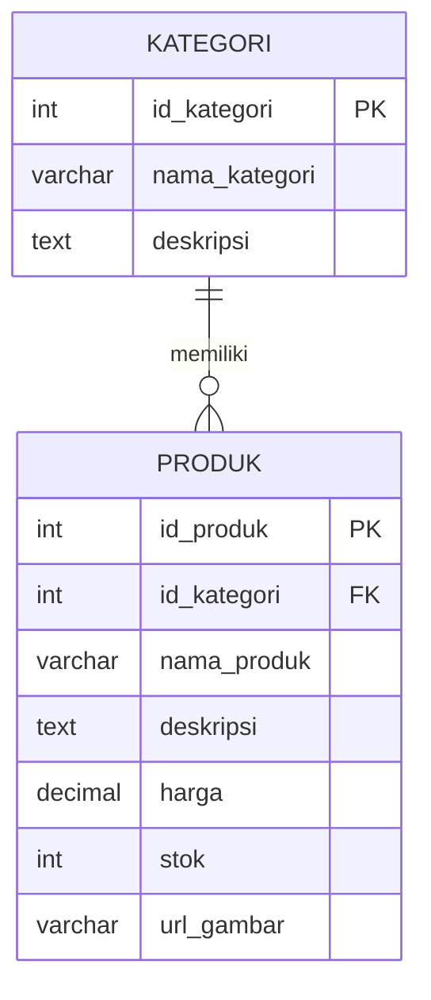

Rancangan tabel Produk dan Kategori sederhana


Berikut query SQL untuk membuat tabel-tabel tersebut:

```sql
CREATE TABLE kategori (
    id_kategori INT PRIMARY KEY AUTO_INCREMENT,
    nama_kategori VARCHAR(100) NOT NULL,
    deskripsi TEXT
);

CREATE TABLE produk (
    id_produk INT PRIMARY KEY AUTO_INCREMENT,
    id_kategori INT,
    nama_produk VARCHAR(200) NOT NULL,
    deskripsi TEXT,
    harga DECIMAL(10,2) NOT NULL,
    stok INT NOT NULL DEFAULT 0,
    url_gambar VARCHAR(255),
    FOREIGN KEY (id_kategori) REFERENCES kategori(id_kategori)
);
```

Struktur tabel :

1. Tabel KATEGORI:
   - id_kategori: Primary key, auto increment
   - nama_kategori: Nama kategori produk
   - deskripsi: Deskripsi kategori (opsional)

2. Tabel PRODUK:
   - id_produk: Primary key, auto increment
   - id_kategori: Foreign key yang merujuk ke tabel KATEGORI
   - nama_produk: Nama produk
   - deskripsi: Deskripsi produk
   - harga: Harga produk
   - stok: Jumlah stok produk
   - url_gambar: URL gambar produk

Relasi one-to-many: satu kategori dapat memiliki banyak produk, dan satu produk hanya dapat memiliki satu kategori.
