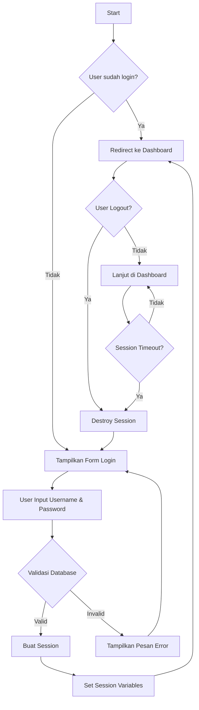

# Modul Pembelajaran PHP Session

## A. Pendahuluan
Session adalah cara untuk menyimpan data user sementara di server yang dapat diakses di berbagai halaman website. Session biasanya digunakan untuk:
- Menyimpan status login user
- Shopping cart pada e-commerce
- Menyimpan preferensi user sementara
- Dan lain-lain

## B. Cara Kerja Session
1. Ketika session dimulai (`session_start()`), PHP akan membuat ID unik (PHPSESSID)
2. ID ini dikirim ke browser client sebagai cookie
3. File session dibuat di server (biasanya di folder tmp) dengan ID tersebut
4. Data session disimpan di file tersebut
5. Ketika user membuka halaman lain, browser mengirim cookie PHPSESSID
6. PHP membaca file session berdasarkan ID tersebut
7. Session berakhir ketika browser ditutup atau session di-destroy

## C. Praktik Session Sederhana

### 1. Membuat Session (create_session.php)
```php
<?php
session_start();
$_SESSION['username'] = "John Doe";
$_SESSION['role'] = "admin";
echo "Session telah dibuat!";
?>
```

### 2. Membaca Session (read_session.php)
```php
<?php
session_start();
if(isset($_SESSION['username'])) {
    echo "Welcome " . $_SESSION['username'];
    echo "<br>Role: " . $_SESSION['role'];
} else {
    echo "No session found!";
}
?>
```

## D. Sistem Login dengan Session

### 1. Flowchart Session Login



### 2. Penjelasan Flowchart

#### a. Pengecekan Status Login
- Sistem mengecek apakah user sudah login dengan memeriksa session
- Jika session ada, user langsung diarahkan ke dashboard
- Jika tidak ada session, user diarahkan ke form login

#### b. Proses Login
1. User mengisi form login (username dan password)
2. Sistem melakukan validasi ke database:
   - Mengecek apakah username ada
   - Memverifikasi password dengan hash yang tersimpan
3. Jika valid:
   - Sistem membuat session baru
   - Menyimpan data user ke dalam session
   - Redirect ke dashboard
4. Jika tidak valid:
   - Menampilkan pesan error
   - Kembali ke form login

#### c. Proses di Dashboard
1. Setiap akses ke dashboard:
   - Cek keberadaan session
   - Cek timeout session
2. User dapat:
   - Melanjutkan aktivitas di dashboard
   - Memilih untuk logout

#### d. Proses Logout
1. User memilih logout:
   - Session dihapus (destroy)
   - Redirect ke halaman login
2. Atau session timeout:
   - Session otomatis dihapus
   - User diarahkan ke login

### 3. Implementasi Database

#### a. Buat Database dan Tabel
```sql
CREATE DATABASE login_db;
USE login_db;

CREATE TABLE users (
    id INT AUTO_INCREMENT PRIMARY KEY,
    username VARCHAR(50) NOT NULL,
    password VARCHAR(255) NOT NULL,
    name VARCHAR(100) NOT NULL
);

INSERT INTO users (username, password, name) 
VALUES ('admin', '$2y$10$YourHashedPasswordHere', 'Administrator');
```

#### b. Koneksi Database (config.php)
```php
<?php
$host = "localhost";
$dbuser = "root";
$dbpass = "";
$dbname = "login_db";

$conn = mysqli_connect($host, $dbuser, $dbpass, $dbname);
if (!$conn) {
    die("Connection failed: " . mysqli_connect_error());
}
?>
```

### 4. Halaman Login (login.php)
```php
<?php
session_start();
require_once 'config.php';

if(isset($_POST['login'])) {
    $username = mysqli_real_escape_string($conn, $_POST['username']);
    $password = $_POST['password'];
    
    $query = "SELECT * FROM users WHERE username = '$username'";
    $result = mysqli_query($conn, $query);
    
    if(mysqli_num_rows($result) == 1) {
        $row = mysqli_fetch_assoc($result);
        if(password_verify($password, $row['password'])) {
            $_SESSION['user_id'] = $row['id'];
            $_SESSION['username'] = $row['username'];
            $_SESSION['name'] = $row['name'];
            
            header("Location: dashboard.php");
            exit();
        } else {
            $error = "Password salah!";
        }
    } else {
        $error = "Username tidak ditemukan!";
    }
}
?>

<!DOCTYPE html>
<html>
<head>
    <title>Login</title>
</head>
<body>
    <h2>Login Form</h2>
    <?php if(isset($error)) echo "<p style='color: red'>$error</p>"; ?>
    
    <form method="POST">
        <p>
            Username: <input type="text" name="username" required>
        </p>
        <p>
            Password: <input type="password" name="password" required>
        </p>
        <p>
            <input type="submit" name="login" value="Login">
        </p>
    </form>
</body>
</html>
```

### 5. Dashboard (dashboard.php)
```php
<?php
session_start();

// Cek apakah user sudah login
if(!isset($_SESSION['user_id'])) {
    header("Location: login.php");
    exit();
}
?>

<!DOCTYPE html>
<html>
<head>
    <title>Dashboard</title>
</head>
<body>
    <h2>Welcome, <?php echo $_SESSION['name']; ?>!</h2>
    <p>Username: <?php echo $_SESSION['username']; ?></p>
    <a href="logout.php">Logout</a>
</body>
</html>
```

### 6. Logout (logout.php)
```php
<?php
session_start();

// Hapus semua data session
session_destroy();

// Redirect ke halaman login
header("Location: login.php");
exit();
?>
```

## E. Keamanan dan Best Practices
1. Selalu gunakan `session_start()` di awal file yang menggunakan session
2. Gunakan `password_hash()` untuk mengenkripsi password sebelum disimpan di database
3. Gunakan `password_verify()` untuk memverifikasi password
4. Hindari menyimpan data sensitif di session
5. Selalu bersihkan session saat logout
6. Gunakan HTTPS untuk keamanan transmisi data
7. Implementasikan timeout session untuk keamanan tambahan

## F. Contoh Implementasi Timeout Session
```php
<?php
session_start();

// Set timeout session 30 menit
$timeout = 1800; // 30 menit * 60 detik

if(isset($_SESSION['last_activity'])) {
    $inactive = time() - $_SESSION['last_activity'];
    if($inactive >= $timeout) {
        session_destroy();
        header("Location: login.php");
        exit();
    }
}

$_SESSION['last_activity'] = time();
?>
```
